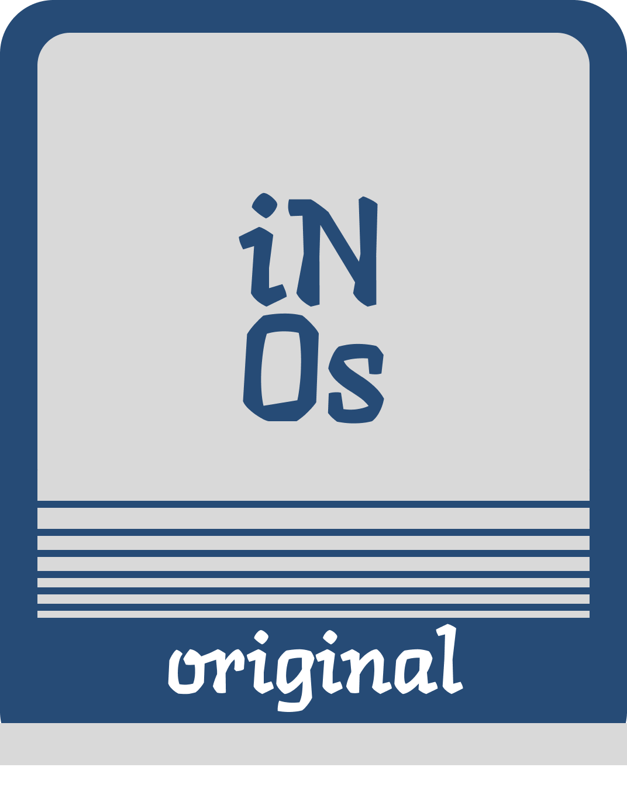

  
  # **Описания репозитория InOs**

  ##### by oneon4i

-----

### **InOs**  
Операционная система  

   

-----

### **inKernel**  
Ядро операционной системы InOs  

Низкоуровневое ядро, обеспечивающее работу всех компонентов.  

 

-----

## Ссылки:

[Последний релиз](https://github.com/oneon4i/inos)

   
